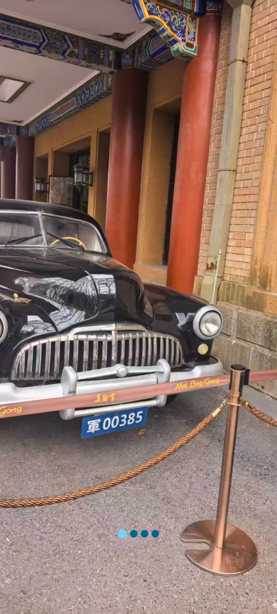
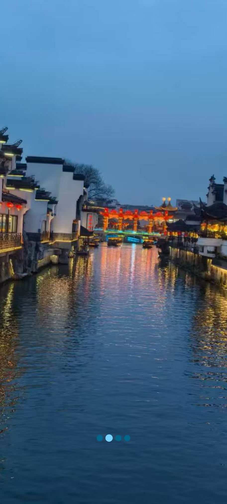
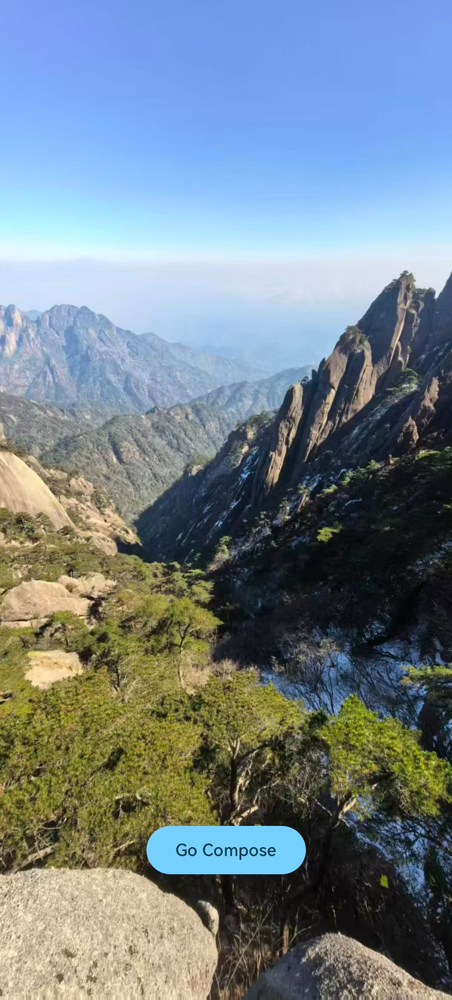

# WanandroidComposeApp

玩安卓App Compose版本

# 前言

用于学习了解 Compose UI 开发，欢迎提 [Issues](https://github.com/Tanganhuan/wanandroid_compose/issues)

# 下载体验

[pgyer下载](https://www.pgyer.com/wananzhuo-android-6)

扫码下载

如果下载失败，请使用 [github releases 下载](https://github.com/Tanganhuan/wanandroid_compose/releases) 或者下载源码编译

# 主要技术框架

| 库          | 版本号        |
| ----------- | ------------- |
| kotlin      | 2.4.0         |
| compose     | 2026.05.00    |
| okhttp      | 5.4.0         |
| retrofit2   | 3.0.0         |
| moshi       | 1.15.2        |
| coil        | 3.5.0         |
| navigation3 | 1.2.0-alpha02 |
| startup     | 1.2.0         |
| datastore   | 1.2.1         |
| bugly       | 4.1.9.3       |

# 主要功能

**闪屏页**：避免启动白屏

**引导页**：ViewPager

**首页**：首页banner/导航/最新学习路径/最受欢迎问答/最受欢迎专栏/置顶文章/首页文章列表

**首页搜索**：热门搜索/历史搜索

**首页导航**：鸿蒙/路线/问答/教程/体系/工具/积分排行榜/安卓导航

**文章详情**：文章列表都可以长按弹出菜单。文章点击后都是跳转到一个网页，可以收藏/分享/在系统浏览器里打开。文章收藏时，先判断是否已经登陆，如果没有登陆则先跳转到登陆

**广场**：广场列表

**项目**：项目列表

**公众号**：公众号作者列表和作者对应的文章列表

**我**：登录/退出登录 /我的收藏/设置

**设置**：深/浅色模式切换

**主题色设置**：选择主题色/状态栏是否跟随主题色

## 闪屏页

## 引导页

|  |  |
| :------------------------------------------: | :------------------------------------------: |
|  |  |

## 首页

- 首页banner
- 导航
- 最新学习路径
- 最受欢迎问答
- 最受欢迎专栏
- 置顶文章
- 首页文章列表

文章列表，都可以长按弹出菜单，文章可以收藏/取消收藏

|  |  |
| :---------------------------------------: | :--------------------------------------------------: |

### 文章详情

文章列表都跳转到网页加载，可以收藏/分享/在浏览器里打开

### 首页搜索

#### 热门搜索

数据从接口获取并做了缓存

#### 历史搜索

记录历史搜索

|  |  |
| :----------------------------------------------: | :-----------------------------------------------------: |

### 首页导航

#### 鸿蒙

鸿蒙开发相关资源

#### 路线

这是一个跳转的网页，安卓开发多个方向的学习路线。

!

#### 问答

问答列表

#### 教程

相关教程，现有“C语言入门教程”，“HTML教程”，“SSH教程”，“Bash脚本教程”，“WebAPI教程”，“JavaScript教程”

#### 体系

#### 工具

一些工具列表

#### 积分排行榜

排行榜点击用户名，可以模糊搜索用户发表的文章

#### 安卓导航

安卓一些相关网站导航

## 广场

## 项目

## 公众号

## 我

### 登录/退出

|  |  |
| :------------------------------------------------: | :---------------------------------------------: |

### 我的收藏

### 设置

#### 深/浅色模式切换

#### 主题色设置

设置主题色

状态栏是否跟随主题色

