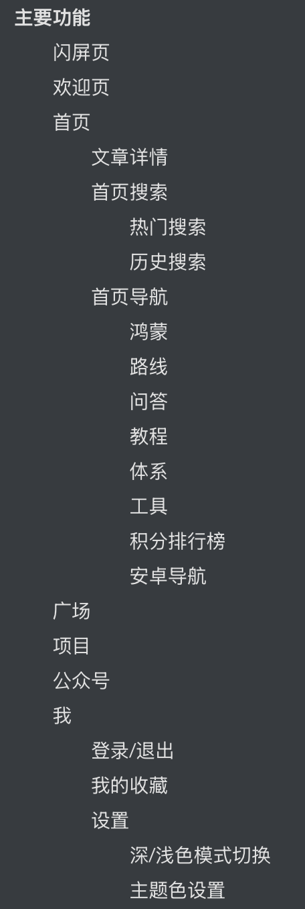

# WanandroidComposeApp

玩安卓App Compose版本

# 前言

用来学习了解 Compose UI 开发

# 主要技术框架

# 主要功能

## 闪屏页

## 欢迎页

|  |  |
| :------------------------------------------: | :------------------------------------------: |
|  |  |

## 首页

- 首页banner
- 导航
- 最新学习路径
- 最受欢迎问答
- 最受欢迎专栏
- 置顶文章
- 首页文章列表

文章列表，都可以长按弹出菜单，文章可以收藏/取消收藏

|  |  |
| :---------------------------------------: | :--------------------------------------------------: |

### 文章详情

文章列表都跳转到网页加载

### 首页搜索

#### 热门搜索

数据从接口获取并做了缓存

#### 历史搜索

记录历史搜索

|  |  |
| :----------------------------------------------: | :-----------------------------------------------------: |

### 首页导航

#### 鸿蒙

鸿蒙开发相关资源

#### 路线

这是一个跳转的网页，安卓开发多个方向的学习路线。

!

#### 问答

问答列表

#### 教程

相关教程，现有“C语言入门教程”，“HTML教程”，“SSH教程”，“Bash脚本教程”，“WebAPI教程”，“JavaScript教程”

#### 体系

#### 工具

一些工具列表

#### 积分排行榜

排行榜点击用户名，可以模糊搜索用户发表的文章

#### 安卓导航

安卓一些相关网站导航

## 广场

## 项目

## 公众号

## 我

### 登录/退出

### 我的收藏

### 设置

#### 深/浅色模式切换

#### 主题色设置

设置主题色

状态栏是否跟随主题色

