# WanandroidComposeApp

玩安卓App Compose版本

# 前言

用来学习了解 Compose UI 开发

# 主要技术框架

# 主要功能

## 闪屏页

## 欢迎页

## 首页

- 首页banner
- 导航
- 最新学习路径
- 最受欢迎问答
- 最受欢迎专栏
- 置顶文章
- 首页文章列表

文章列表，都可以长按弹出菜单，文章可以收藏/取消收藏

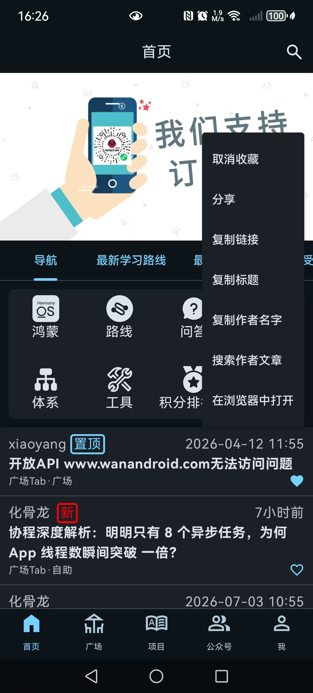

### 文章详情

文章列表都跳转到网页加载

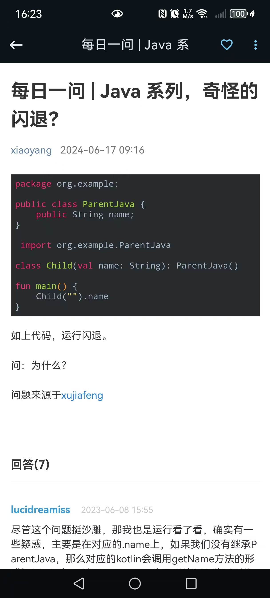

### 首页搜索

#### 热门搜索

数据从接口获取并做了缓存

#### 历史搜索

记录历史搜索

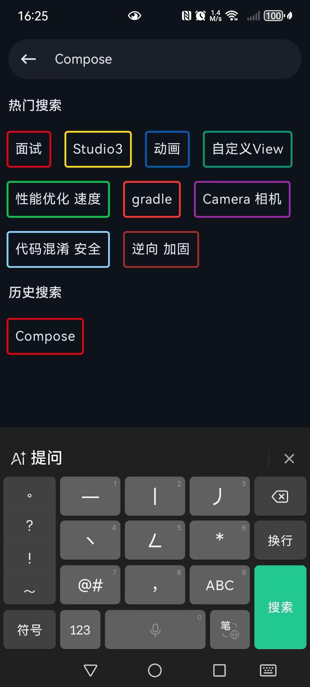

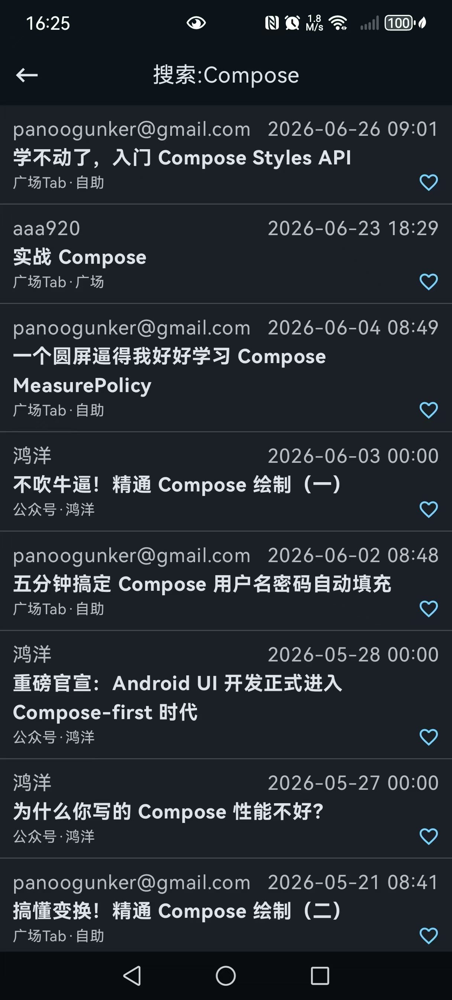

### 首页导航

#### 鸿蒙

鸿蒙开发相关资源

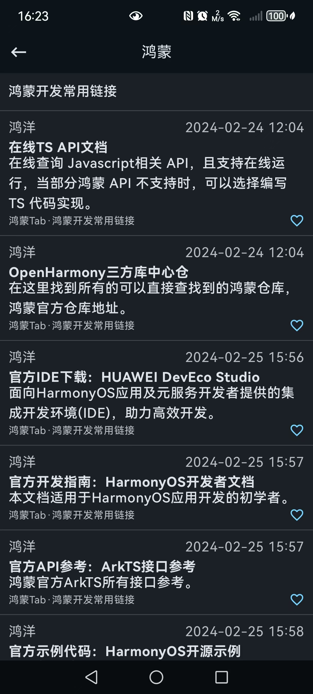

#### 路线

这是一个跳转的网页，安卓开发多个方向的学习路线。

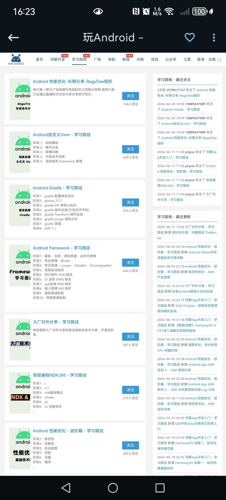

#### 问答

问答列表

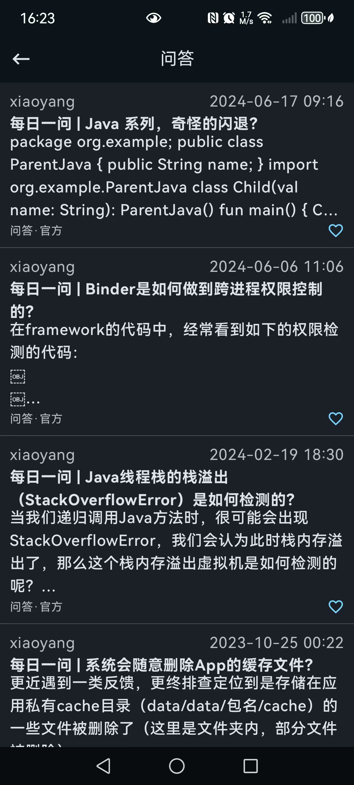

#### 教程

相关教程，现有“C语言入门教程”，“HTML教程”，“SSH教程”，“Bash脚本教程”，“WebAPI教程”，“JavaScript教程”

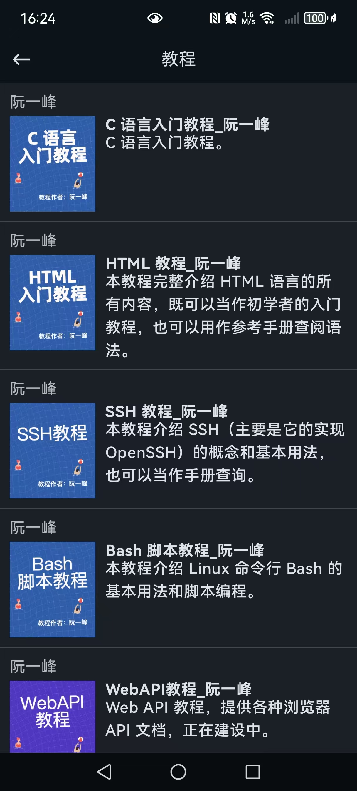

#### 体系

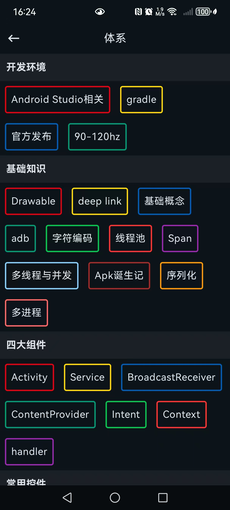

#### 工具

一些工具列表

###### Json格式化转Bean

支持JSON格式化，JSON转Java类，树形展示等

###### todo

在线的清单，帮你记录灵感，统计已经做完的事情。

###### OpenApis

收集的开放 API

###### MD5,SHA等数字摘要

支持MD5,SHA1,SHA224,SHA256,SHA384,SHA512在线转化

###### Google仓库查询

Google仓库查询

###### Base64转化

支持字符串、图文、文件等base64在线计算

###### url decode

url decode / encode 操作

###### 二维码生成

支持二维码在线生成，支持个性化二维码

###### 取色器

支持在线取色，颜色转化

###### Android 版本

Android 版本与 Version Code 对应。

###### iconfont你值得拥有

图标查找

###### tinypng压缩图片

图片压缩

###### 进制转化

支持常见进制转换，各种进制互转2转32以内，32以内转32以内

###### 短链接

支持长连接转化为短链接

###### 速查表

速查表

###### 正则

正则表达式

###### URL按序解析

有一长串复杂的URL？输入解析一下，一目了然~

###### 下载Studio 3.0.1

搭建环境，下载Android Studo、SDK、NDK；版本分布；屏幕尺寸和分布；

###### https安全检测

https安全检测

###### 草稿记事

支持markdown，可以用来临时记录一些笔记。

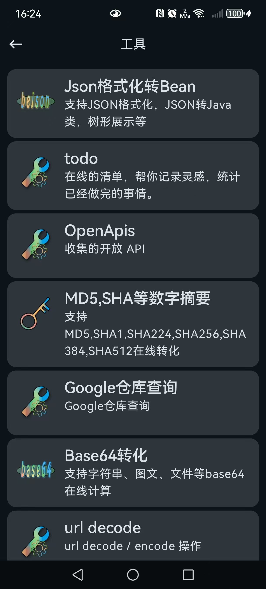

#### 积分排行榜

排行榜点击用户名，可以模糊搜索用户发表的文章

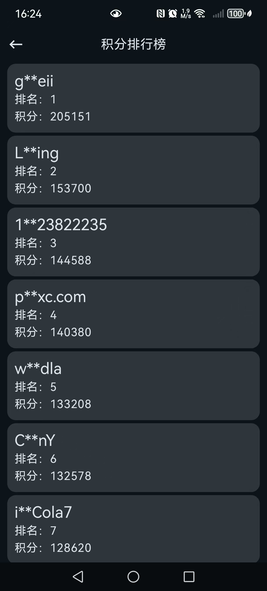

#### 安卓导航

安卓一些相关网站导航

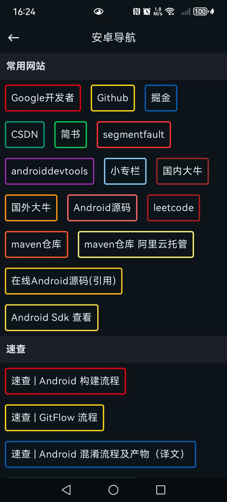

## 广场

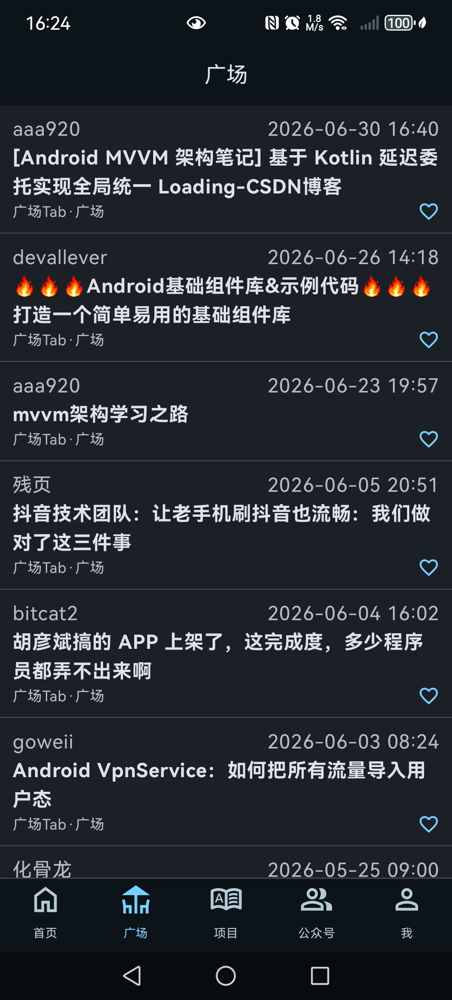

## 项目

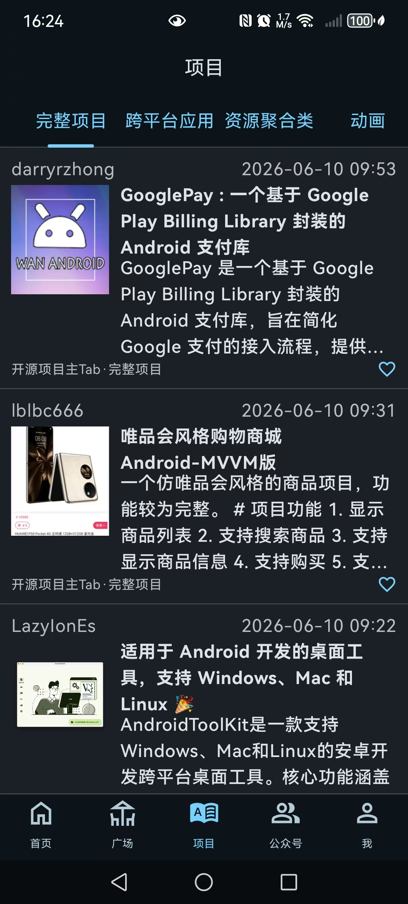

## 公众号

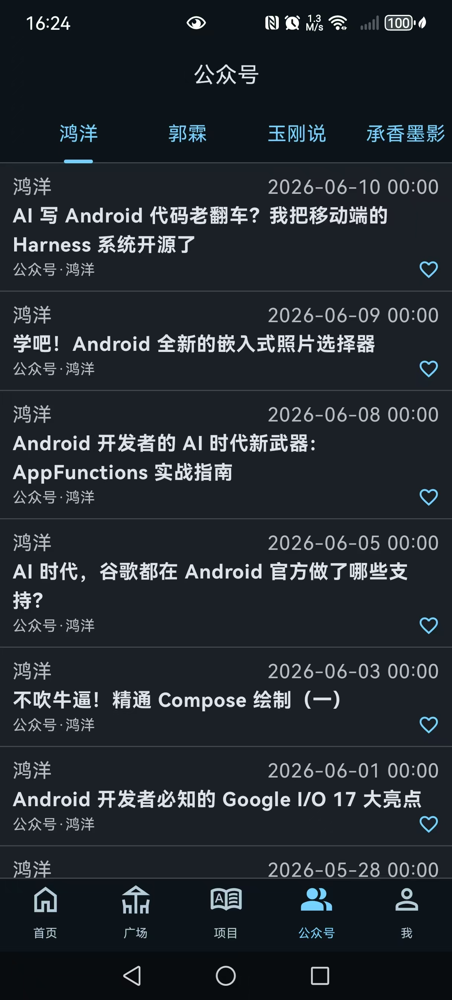

## 我

### 登录/退出

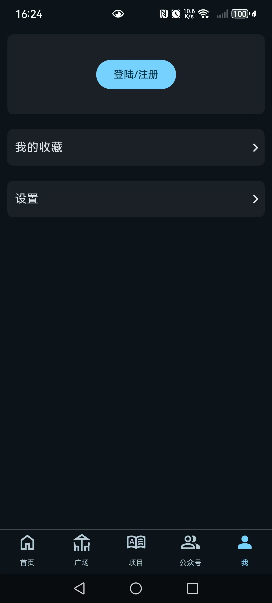

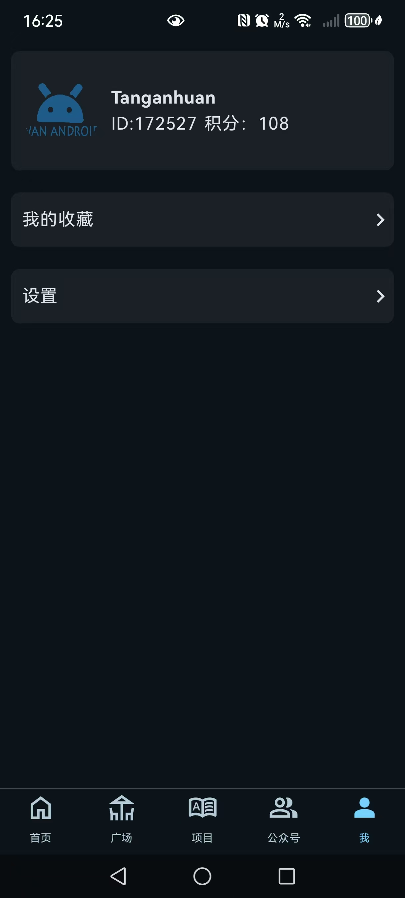

### 我的收藏

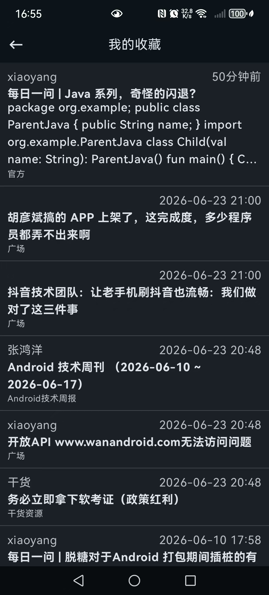

### 设置

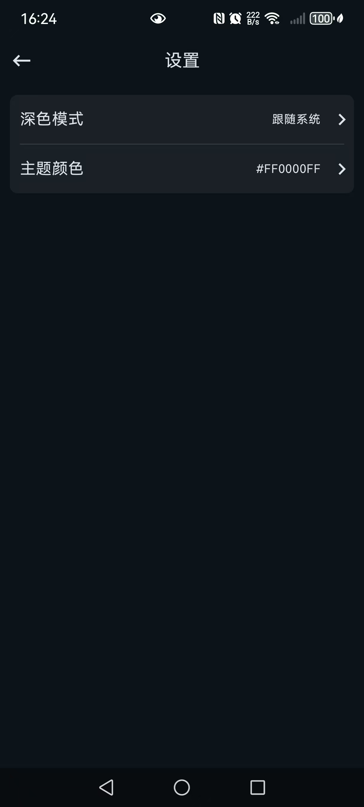

#### 深/浅色模式切换

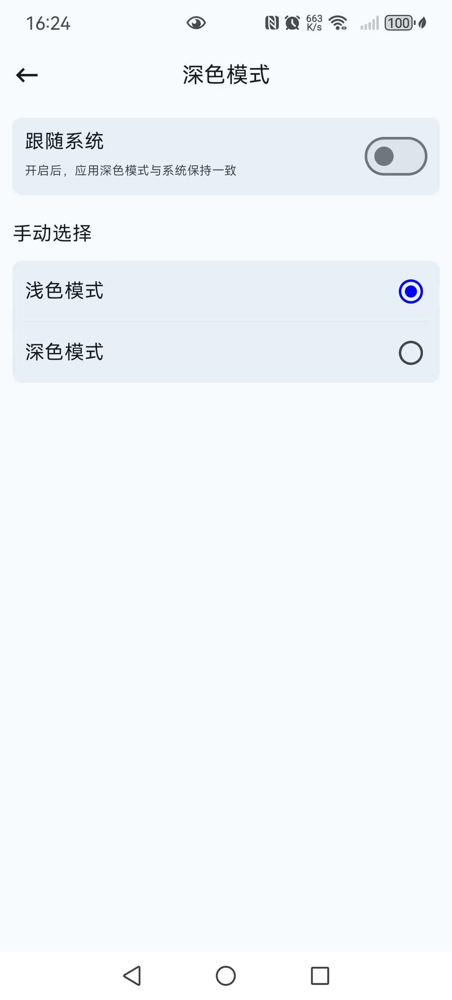

#### 主题色设置

设置主题色

状态栏是否跟随主题色

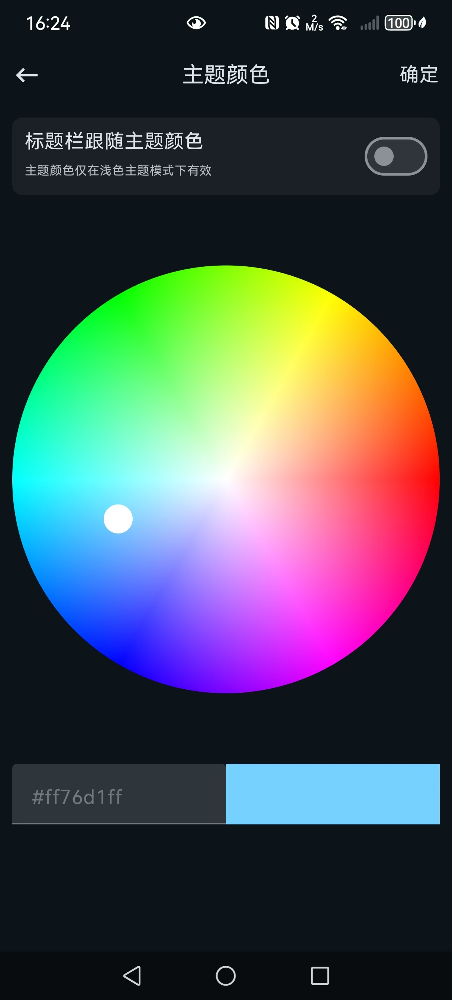